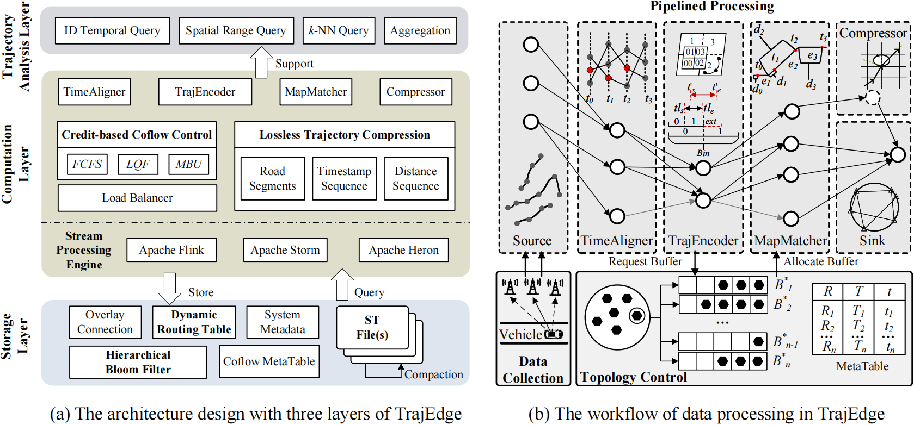

# TrajEdge: An Efficient and Lightweight Trajectory Data Analysis Framework in Edge Environment

## Introduction

This repository holds source code for the paper "TrajEdge: An Efficient and Lightweight Trajectory Data Analysis Framework in Edge Environment".



## Environment Preparation

- Java 11
- Docker
- Docker Compose
- CentOS 7.0

To set a edge simulated environment, you need to install Docker first, then configure the docker cluster:

```bash
cd TrajEdge
docker-compose up -d 
```

Then you will get a cluster of storm in docker container.

Next you can use [tcconfig](https://tcconfig.readthedocs.io/en/latest/pages/usage/tcset/index.html#basic-usage) to set the network latency and bandwidth between docker container for better simulated the edge-to-edge and edge-to-cloud communication.

```bash
tcset eth0 --delay 100ms --rate 100Kbps --network 192.168.0.10
```

BTW, we also provide detailed scripts for configuring the network by running:

```bash
chmod +x ./scripts/configureNetwork.sh & ./scripts/configureNetwork.sh
```

Last, you need to run `python ./scripts/allocateNode.py` for mapping the external node into edge device.

## Datasets Description

We use 2 publicly available real-world trajectory and road map data, which can be obtained from [Geolife](https://research.microsoft.com/en-us/projects), [T-Drive](http://www.geolink.pt/ecmlpkdd2015-challenge/dataset.html). And the synthetic dataset of Oldenburg can be generated in [LINK](https://research.microsoft.com/en-us/projects).

Don't forget to upload your data to all docker container in cluster by using:

```bash
chmod +x ./scripts/copyData.sh & ./scripts/copyData.sh
```

## Usage

1. Prepare your trajectory data like below:

   ```
   [Lat] [Lng] [TimeStamp]
   ```

   Each column is separated by a blank.

2. Modify your data loader class in directory `Spout`

3. Pack the project into fat jar `TrajEdge-storage.jar`  and  `TrajEdge-stream.jar` using Maven 

4. Set up the storage cluster of TrajEdge

   ```bash
   chmod +x ./scripts/deployStorage.sh & ./scripts/deployStorage.sh
   ```

5. Copy the jar to docker and run the topology `TrajectoryUploadTopology` to store trajectory data

   ```bash
   docker cp ./TrajEdge-stream/target/TrajEdge-stream-1.0-SNAPSHOT.jar nimbus:/opt/storm/lib/
   
   docker exec -it nimbus storm jar /opt/storm/lib/TrajEdge-stream-1.0-SNAPSHOT.jar org.example.TrajectoryUploadTopology test-1 true 1000
   ```

6. Run the query topology, including  `TrajectoryIdQueryTopology` , `TrajectorySpacialRangeQueryTopology`,  `TrajectoryTimeRangeQueryTopology` and `TrajectorykNNQueryTopology`.

   ```bash
   # ID temporal
   docker exec -it nimbus storm jar /opt/storm/lib/TrajEdge-stream-1.0-SNAPSHOT.jar org.example.TrajectoryIdQueryTopology 1 0 8 geolife
   # space range
   docker exec -it nimbus storm jar /opt/storm/lib/TrajEdge-stream-1.0-SNAPSHOT.jar org.example.TrajectorySpacialRangeQueryTopology 1 true 1 geolife
   # space time range
   docker exec -it nimbus storm jar /opt/storm/lib/TrajEdge-stream-1.0-SNAPSHOT.jar org.example.TrajectorySpacialTemporalRangeQueryTopology 1 8 geolife
   # k-nn
   docker exec -it nimbus storm jar /opt/storm/lib/TrajEdge-stream-1.0-SNAPSHOT.jar org.example.TrajectorykNNQueryTopology 1 true 8 geolife 1
   ```

## Citation

If you use our code for research work, please cite our paper as below:

```
@article{,
  title={TrajEdge: An Efficient and Lightweight Trajectory Data Analysis Framework in Edge Environment},
  author={Changhao He, Ziquan Fang, Linsen Li, Yunjun Gao},
  year={2025},
}
```